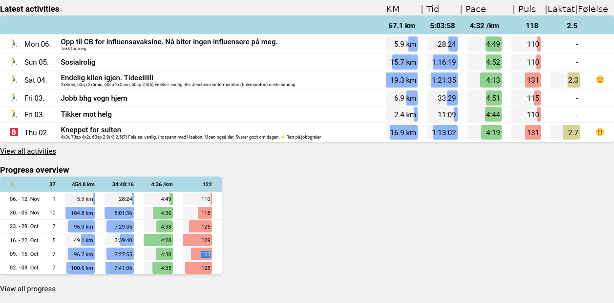

# Brukerveledning for skvidar.run

> I SK Vidar legger vi stor vekt på terskeltrening. I tradisjonelle treningsapplikasjoner er det lett å få overblikk over hvor mange km man løper i uka, men vanskelig å finne ut hvor mye mengde man har løpt terskel. Dette ønsket vi å lage, og med _det_ ble skvidar.run skapt.

## Første innlogging

* Du må være medlem av Strava gruppa [SK Vidar](https://www.strava.com/clubs/97233) for at siden skal fungere.
* Gå til [nettsiden](https://skvidar.run/), og trykk "Sign in" øverst til høyre hjørnet.
* Godkjenn at vi henter inn dine økter.

Nå vil prosessen med å hente inn alle dine treningsdata starte, noe som kan ta litt tid om du har mye data. Denne kjører i bakgrunnen, så det er bare å lukke vinduet og gjøre noe annet imens.

## Hvordan få inn data

Det meste av dataene vi trenger blir hentet fra øktene på Strava. Dessverre har ikke Strava støtte for laktat og følelse. Vi må derfor skrive dette i "description" feltet på strava.

#### Laktat
Laktat kan skrives på flere måter, men den mest vanlige å bruke er:

```
Laktatverdi, (intervallnummer)
2,3 (4)
```
Eksempelet over viser at du målte 2,3 etter intervalldrag nummer 4.
Måler du flere ganger iløpet av økta, lager du flere linjer.

```
2,4 (4)
2,5 (6)
2,8 (10)
```

#### Følelse
Vi har tre muligheter for følelse:
```
Følelse: Tung
Følelse: Vanlig
Følelse: Lett
```
Du kan skrive både med stor forbokstav og uten.

Vi ønsker en måte å forklare følelsen under økta. Det er mye diskutert hva som ligger i følelse. Du står selvfølgelig fritt til å bruke det som du vil. Men dette er måten jeg (Fredrik Fyksen) bruker det.
Jeg liker å bruke følelse sett i sammenheng med hvordan en økt pleier å føles. Løper jeg `10x1000m` på 10000m fart, vil økta alltid være tung, siden det er en tung økt. Men om følelsen på økta er som den pleier å være på en slik økt, vil jeg skrive `følelse: vanlig`.

Om jeg løper en terskeløkt, si 5x2000m, så vil den økta normalt føles normal. Om den føles tung, selv om jeg løper på samme intensitet som jeg vanligvis gjør, så ville jeg skrevet `følelse:tung`.

## Hovedsidene

### [Home](https://skvidar.run/)
* Under Home kan du se de siste øktene du har lastet opp til Strava, samt en kort Progress overview.
* All dataen kan være overveldende i starten, men man blir fort vant til hva de forskjellige grafene betyr.


På dette bildet er det lagt på tekst over dataene for å tydeliggjøre data på grafene.

### [Activities](https://skvidar.run/activities)
* Her kan du se en oversikt over økter.
* Du kan velge å bare se økter som er identifisert med intervaller.

::: details Se video-eksempel
<video controls>
  <source src="/tresh/index-activities-2.mp4" type="video/mp4">
  Nettleseren din støtter ikke videoformatet.
</video>
:::

### [Progress](https://skvidar.run/progress)
* Her kan du se en oversikt over treningen din.
* Du kan sortere på måneder, uker, eller egendefinert.
* Du kan filtrere på alle, kun intervaller eller treshold data. 
* Dette er en fin måte å visualisere mengden intervaller løpt.
* Pace, puls og laktat viser gjennomsnitt for måned eller uke, avhengig av hvordan du sorterer.

::: details Se video-eksempel
<video controls>
  <source src="/tresh/index-progress-2.mp4" type="video/mp4">
  Nettleseren din støtter ikke videoformatet.
</video>
:::

### [Intervals](https://skvidar.run/intervals)
Intervals siden er delt i to. Den øverste delen med `Distance`, `Pace` og `Lactate` viser grafer for verdiene. Den nederste delen viser de siste intervalløktene dine.

* Som på de andre sidene kan du filtrere på aktivitetstype, velge tidspunkt for hvilke økter du vil se, og aktivitetsdata.
* Du kan "sveve" musen over grafene for å få mer data. Om du er på mobil, kan du "holde inne" over grafen.

#### Distanse-grafen
Denne grafen viser mengde i km. Intervall vises som blått, og total mengde som grått.

#### Pace-grafen
Denne grafen viser hastighet på intervallene. Hastigheten blir sortert i:
* Short intervalls - Intervaller med draglengde under 2 minutter.
* Medium intervalls - Intervaller fra 2 minutter til 10 minutter.
* Long intervalls - Intervaller lengre enn 10 minutter.

Grafens høyde avhenger av hastighet på dragene. Dette er gjennomsnitt av alle dragene sortert på uke eller måned.

#### Lactate-grafen
* Den blåe grafen viser gjennomsnitt laktat gruppert i uker eller måneder.
* De grå heksagon i bakgrunnen viser samlingen av målinger.


# Brukerdata
Programmet fungerer ved å laste ned dine Stravaøkter og lagrer dem som en fil på vår server. Vi ser ikke på dataen din, men det er viktig for oss å formidle at dataene dine ligger på våre servere.
Ønsker du å slette all dataen du har lagret hos oss, kan du besøke denne URLen: https://skvidar.run/api/debug/cleardata. Hvis du besøker denne lenken, vil dataene dine bli slettet automatisk uten noen form for tilbakemelding eller forespørsel om bekreftelse.

# Vil du bidra?
Skvidar.run er åpen kildekode, du kan se all kode her [https://github.com/TreshLaps/Activities](https://github.com/TreshLaps/Activities). Kom gjerne innom Slack-kanalen #tekprat på Skvidar sin Slack.

# Kontakt
Har du spørsmål eller forbedringsforslag?

* Skriv en epost til fredrik@fyksen.me
* Skriv til oss på #tekprat på Slack.